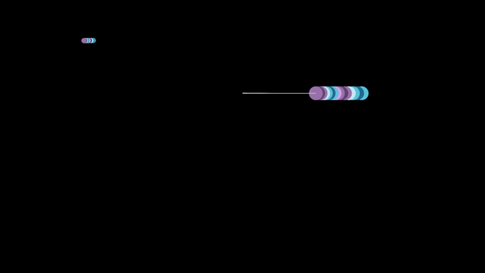

# ManimProjects

Manim is a Python library for creating professional mathematical animations. This repository contains some Manim projects that demonstrate the versatility of the library by showcasing various mathematical equations and interesting patterns.

Below are a selection of animated GIFs that showcase some visually appealing animations created using Manim:

Petals:  

Flower:  

Spiral Squares:  

Expanding Circles:  

Lituus Curve:  

Pendulum:  

Pendulum version 2:  

Archimedes Spiral:  

